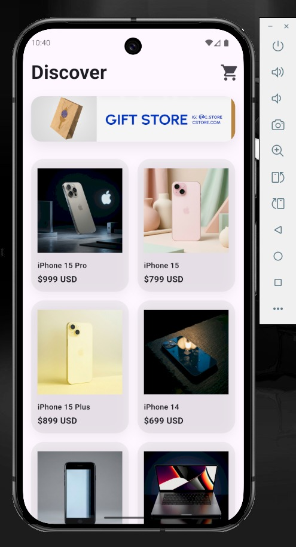
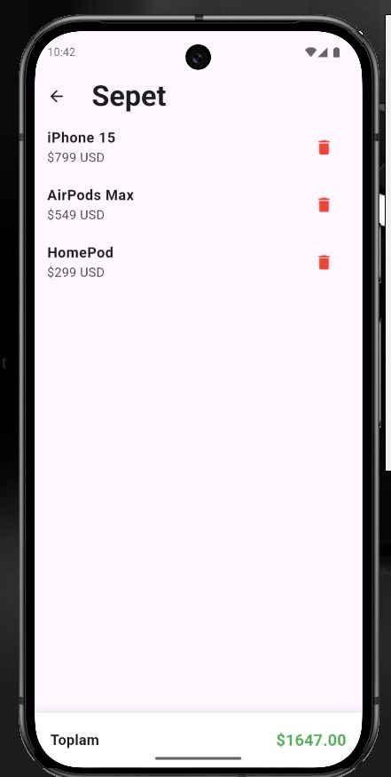

# Mini Store App

## ▪ Proje Adı

Mini Store App

## ▪ Kısa Açıklama

Mini Store App, Flutter kullanılarak geliştirilmiş basit bir e-store katalog uygulamasıdır.
Uygulama bir ürün listesini API üzerinden çekerek GridView içinde gösterir. Kullanıcılar ürün detaylarını görüntüleyebilir, ürünleri sepete ekleyebilir ve sepetteki ürünlerin toplam fiyatını görebilir.

Bu proje Flutter’da **Navigator kullanımı, Route Arguments, API veri çekme, GridView tasarımı ve temel state yönetimi** konularını göstermek amacıyla geliştirilmiştir.

## ▪ Kullanılan Flutter Sürümü

Flutter SDK: **3.41.2**
Dart: **3.11.0**

## ▪ Çalıştırma Adımları

1. Projeyi klonlayın:

```
git clone https://github.com/kullaniciadi/mini_store_app.git
```

2. Proje klasörüne gidin:

```
cd mini_store_app
```

3. Gerekli paketleri yükleyin:

```
flutter pub get
```

4. Uygulamayı çalıştırın:

```
flutter run
```

Uygulama çalıştığında ana sayfada API’den gelen ürün listesi görüntülenecektir.

## Ekran Görüntüleri

### Home Screen


### Detail Screen


### Cart Screen
